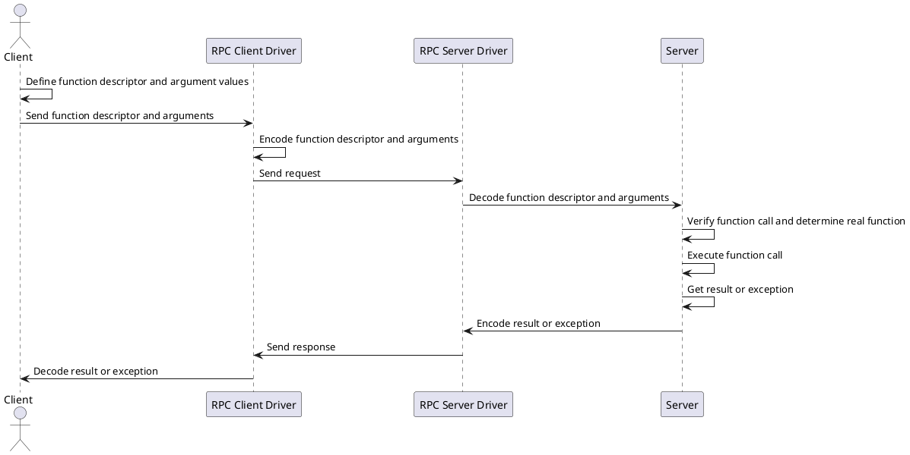

# General statement of the problem for remote procedure calls

## Problem

The problem is to implement a remote procedure call (`RPC`) system that allows a `client` to call 
a `function` on a `server` as if it were a local function call. 

The `client` should be able to pass arguments to the function and receive the return value from the function. 

Both the `client` and the `server` are aware of the function `call specification`, 
which they need to correctly marshal data over the network.

The `client` and `server` usually use the `function name` or the `service and function name` to find the call specification.
Sometimes a flexible call specification is necessary, which is based on other criteria.

The `data types` of the arguments\return value should be such that they are easily implementable in different programming languages.

The `client` and `server` should be able to handle `errors` that occur during the `RPC` call.

## Features of PHP and useful constraints

`PHP` supports a highly flexible set of data types for passing arguments and return values. 
This makes it less convenient compared to other programming languages. 
Therefore, it is wise NOT to use all of PHP's capabilities when constructing remote procedures.

However, it would be unwise to completely block the possibility of remote calls between PHP components. 
Therefore, we adhere to the philosophy of avoiding PHP features that are difficult to serialize in other languages.

## General Flow for Remote Call

Let’s say we have a function `myFunction(...myArguments): ReturnType`. 
The process needed for data marshaling looks like this:

* Create a `function descriptor` that describes the function in such a way 
that the remote server can identify the metadata associated with the function.
* Define type descriptors for all `function arguments`.
* Define a type descriptor for the `return value`.
* Define type descriptors for `exceptions` (if the protocol supports an error channel).

Let's describe the general process of a remote procedure call:

There are many implementations of `RPC` protocols, as well as implementations
of protocols that can be represented as `RPC`, such as `REST`.

Since our task is to abstract from the specific method of remote procedure calls, 
we will assume that the `RPC` protocols used should support the main features of remote calls, such as:

* A function descriptor as a pointer to the function to be called
* Arguments that can be encoded and decoded according to type information
* A result that can be encoded and decoded
* An error channel that can be encoded and decoded

## Meta-information for data decoding

There are two fundamental approaches to encoding and decoding data in RPC calls:

* Marshaling without transmitting meta-information for data decoding
* Marshaling with transmitting meta-information for data decoding

Meta-information for data decoding consists of instructions/rules for converting a request into a 
set of parameters for the remote function call.

Protocols like `GRPC` are based on the first method. 
In this case, the meta-information for encoding and decoding call data is contained 
in the application code and is known in advance. 
This method of encoding and decoding is the most common.

For the `JSONRPC` protocol, meta-information is not explicitly present and must be located in the application code.

However, there are situations where it is necessary to transmit meta-information 
about decoding directly within the request. This may be required for calls between workers. 
Essentially, the PHP function `serialize` does exactly this; 
it embeds meta-information about the class directly within the data.